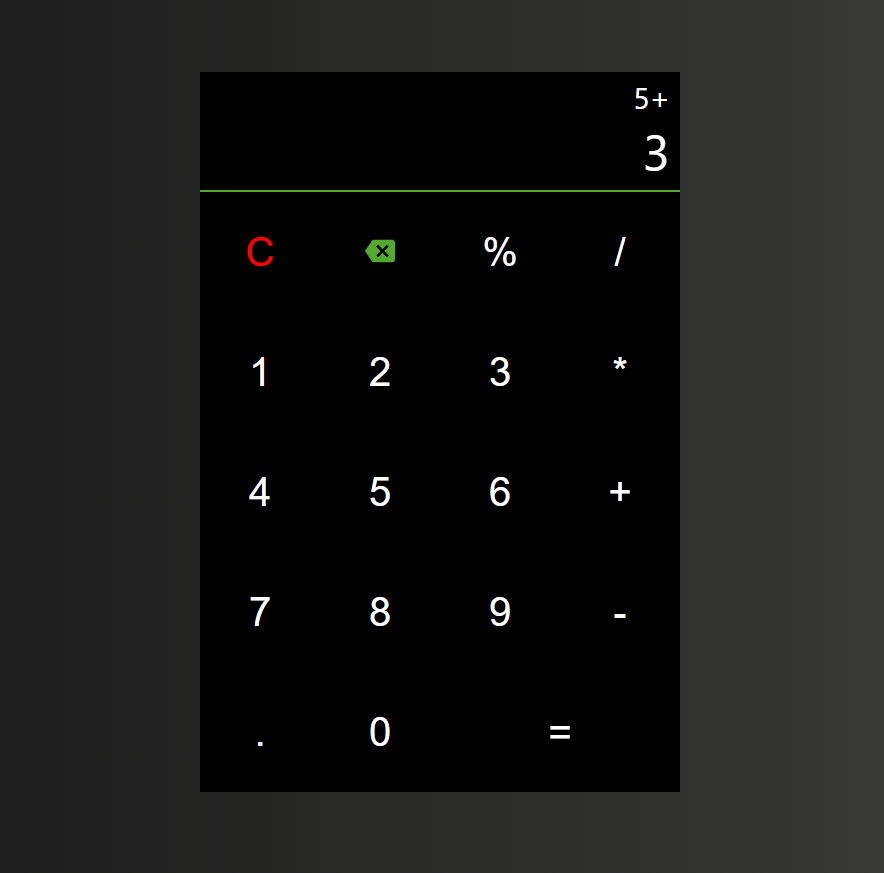

# Calculator app using ReactJS

This is a simple calculator app which has simple mathematical operations like addition, subtraction, multiplication, division and modulus.

I've used [useReducer()](https://reactjs.org/docs/hooks-reference.html#usereducer) hook for this app which handles all the state in this app.

## Snapshot of the app

